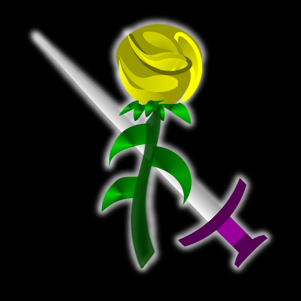

# MEAK

*Esta é a história de alguém que perdeu uma parte importante de si,*
*algo que diz quem somos. A coisa mais importante que um ser possui.*
*Aquilo sem o que você se torna apenas um amontoado de átomos ao acaso.*

*Esta é a história de um amontoado de átomos ao acaso tentando voltar a ser.*

[Leia no Site](http://meak.com.br/)

## Stories Site

Source code of the website at http://meak.com.br

***This is not the better code I ever wrote. Don't judge me by it.***

### ePub

Added a [tutorial](docs/ePub.md) of how to make an ePub from a HTML of your
book.
